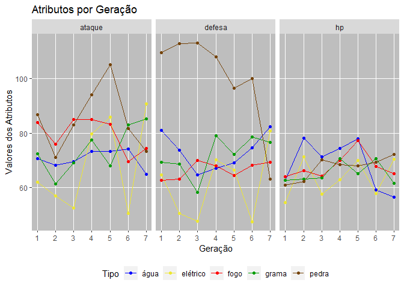

Trab\_Final\_R4D2
=================

O Objetivo desse estudo foi verificar a evolucao dos atributos principais dos Pokemons ao longo das geracoes. Para esse estudo estamos considerando como atributo: HP, ataque e defesa

E os seguintes tipos de Pokemon: agua, fogo, grama, pedra e eletrico.

o estudo foi conduzido realizando a media desses atributos e comparando esses valores ao longo das diferentes geracoes.

Para fazer isso foi necessario tratar a base e tirar os Pokemons que nao tinham nenhuma geracao e transformar as colunas "tipo\_1" e "tipo\_2" em uma unica coluna para gerar o grafico de forma mais completa possivel.

``` r
ggplot(data = pokemon_3, aes(x = id_geracao, y = value, color = tipo),
       xlab = "Geração", title = "Média dos Atributos por Geração") +
  geom_line() +
  geom_point(size = 1.5) +
  scale_color_manual(values=c("blue", "#ede732","red", "#029e04", "#75440b")) +
  facet_wrap(~Atributos) +
  labs(
    title = "Atributos por Geração",
    x = "Geração",
    y = "Valores dos Atributos",
    color = "Tipo"
  ) +
  scale_x_continuous(breaks = c(1, 2, 3, 4 ,5 ,6 ,7))+
  theme(
        legend.position = "bottom",
    panel.background = element_rect(fill = "grey"),
    panel.grid.minor.x = element_blank(),
    panel.grid.minor.y = element_blank())
```



Podemos observar pelos graficos que ao longo do tempo muitos dos atributos dos Pokemons foram alterados drasticamente especialmente para o tipo pedra que era na media era o mais forte de todos nas geracoes iniciais, pois tinha uma defesa muito superior aos demais e um ataque que na media perdia apenas para os Pokemons do tipo fogo nas geracoes 2 e 3.

Os Pokemons do tipo eletrico sao os que mais sofreram alteracoes ao longo das geracoes, sendo que nas geracoes mais recentes ele se tornou uma das escolhas mais poderosas combinando um bom ataque, defesa e HP.

Alem disso, conseguimos observar que os Pokemons do tipo agua sao mais voltados para defesa e HP do que ataque enquanto os do tipo fogo sao o oposto. Os do tipo grama nao tinham nenhum destaque especial nas geracoes mais antigas, mas atualmente possuem, na media, o maior ataque das tres categorias bem como uma das melhores defesas e HP.

Em parâmetros gerais aos atributos dos Pokemons sofrem grandes variacoes de uma geracaoo para a outra, sendo dificil prever um tipo superior aos demais e que apesar de todas essas geracoes terem se passado, os Pokemons mais antigos ainda conseguem competir com os mais novos.
